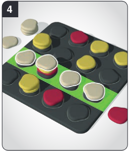
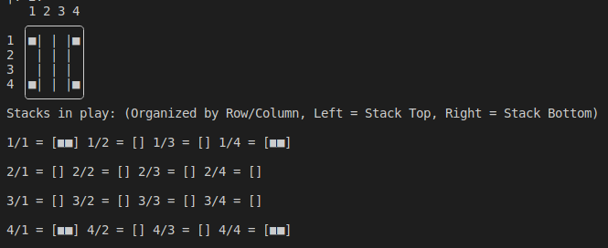

# PFL TP2: Qawale

## Grupo T11_Qawale3

### Pedro Alexandre Ferreira e Silva - up202004985 (50%)

### José Maria Borges Pires do Couto e Castro - up202006963 (50%)

# 1. Installation and Execution

### Linux:

In Linux, just the basic SICSTUS 4.7.1 installation is needed. Consult the `game.pl` file by writing `consult('game.pl').` to install the required dependencies and execute the program by running the `play/0` predicate.

### Windows:

For program execution in Windows, only the basic SICSTUS 4.7.1 installation is needed. However, to have the most faithful recreation of the game's display on Linux, change SICSTUS' console font to 'Consolas', as displayed in the screenshot below:


Consult the `game.pl` file by writing `consult('game.pl').` to install the required dependencies and execute the program by running the `play/0` predicate.

# 2. Game Description

The chosen game for this project was [Qawale](https://www.hachetteboardgames.com/products/qawale). Its product page is found [here](https://www.hachetteboardgames.com/products/qawale) and its ruleset, as explained below, is found [here](https://randolphca.sharepoint.com/sites/Public/Documents%20partages/Forms/AllItems.aspx?id=%2Fsites%2FPublic%2FDocuments%20partages%2FSales%20%2D%20Ventes%2FTOOLS%20%2D%20OUTILS%2FVisuels%20jeux%20%2D%20Games%20Visual%2FUSA%2FQawale%20%2D%20media%20kit%2FQawale%20%2D%20rules%2Epdf&parent=%2Fsites%2FPublic%2FDocuments%20partages%2FSales%20%2D%20Ventes%2FTOOLS%20%2D%20OUTILS%2FVisuels%20jeux%20%2D%20Games%20Visual%2FUSA%2FQawale%20%2D%20media%20kit&p=true&ga=1).

## Rules

Qawale is a 2-player versus game in which both players start with 8 pebbles of a specific color. Because of this, the game has a total turn count of 16. To simplify, we made each player's pieces `Circles` and `Triangles` and made the neutral pieces into `Square` ones.
To win, a player needs to make a line out of 4 of their colored pieces (horizontally, vertically or diagonally). These pieces must be the ones at the top of the stack.
If both players have played all their pebbles and no lines have been made, the game ends in a draw. An example of a winning line is shown below:



The game board is a 4 by 4 grid and starts off with 4 stacks of 2 `Squares` in each corner, as shown below:



To play, a player must choose a stack to place one piece. As such, to start, the only available moves are to place a piece in 1/1, 4/1, 1/4 and 4/4. <br> After choosing a piece placement, the player must take that stack of pieces and lay them adjacently to that stack. Each piece gets placed one at a time, starting with the piece at the bottom of the stack. Each piece movement MUST be orthogonally adjacent to the previous one (vertically or horizontally but NOT diagonally). Adding to this, the player cannot move backwards to a space they passed through - they can only circle back to it. This stack movement is displayed in the image below:


# 3. Game Logic:

## 3.1 Internal Representation of the State of the Game

The state of the game is condensed into a pair named `GameState` that consists of the game's `Board` and `Player`. The `Board` is a matrix (list of lists) of 4x4 size where each row contains a list (stack) that can be filled with `Triangle`, `Circle` or `Square` pieces.
The `Player` is an atom that is attached to its piece type, `triangle` or `circle`.

To initialize and setup the game, `initial_state(+Size, -GameState)` is called. Initially, we wanted to try having differing board sizes for different types of difficulty and playing fields, but ultimately decided against it since a 4 by 4 grid for Qawale is fulcrum.

### Examples

These examples represent a state captured right after a full stack movement, except for the initial state. Spacing after every comma was added manually in this document to improve readability.

**Initial state**
```
[[[■, ■], [], [], [■, ■]],
[[], [], [], []],
[[], [], [], []],
[[■, ■], [], [], [■, ■]]]-triangle
```

**Intermediate state**
```
[[[▲, ■, ■], [], [■], []],
[[], [], [■], [▲]],
[[], [●], [▲, ●, ■, ▲], [▲, ●, ■]],
[[], [], [■, ●, ■, ●],[▲, ●, ▲]]]-triangle
```

**Final state**
```
[[[▲, ●, ▲], [●], [], []], 
[[■, ●], [●, ▲, ■, ▲], [●, ■], [■]], 
[[▲], [●, ▲, ●, ▲, ■, ▲], [], [■]], 
[[], [●], [], [■, ■]]]-circle

circle scored a 4-in-a-column, on column 2.
```
<br>
To enter the game loop, the `gamemode` must also be set. Valid gamemodes include 'Human vs Human' (`h/h`), 'Human vs Easy AI' (`h/c1`) and 'Human vs Hard AI' (`h/c2`), although any combination of the 3 player types can be used. The default value is `h/h`.

## 3.2 Game State View

Our program presents a simple but effective interface for the game.
Inputs are also sanitized with auxiliary predicates.

Starting with the menu, we display 3 options onscreen:

1. _Choose gamemode_ - Allows for gamemode and player type selection. Players can either be `h` (human), `c1` (easy computer player) or `c2` (hard computer player). Default is `h/h`.
2. _Start the game_ - Starts the game with the selected gamemode.
3. _Exit the program_ - Exits the program.

For the game's board itself, we used the `board_chars` predicate to construct an easy-to-understand grid with specific hexadecimal characters. We pair this with a text-description of the game state, showing each grid slot's stack below the top-down view of the board, as shown below:


Each of the player's turns are either asked and validated (if the player is human) or calculated if the player is a computer. The `ask_move(+GameState, +PlayerType, +TurnsLeft, -Move)` and `ask_move(+GameState, +PlayerType, +Placement, +TurnsLeft, -Move)` predicates return a move (piece placement and stack movement, respectively) after validating player input through catching `read` errors and checking for valid piece placement and movement in the `move` predicate, detailed in the next section of this report.

## 3.3 Moves Execution

Move validation checks for out-of-bounds inputs and illegal stack movements. the `move` predicate has two variants depending on the move it is performing: a piece placement move (first part of a user's turn) or a stack movement move (latter part). Both of these executions use the `GameState` (Board/Player pair)
and the movement input to validate and return a new GameState.

- _`move(+GameState, +Move, -NewGameState)`_ - Takes in a Row/Col position pair to validate and return a new GameState that will be used in the second part of the turn. To enact the piece placement, Row/Col are validated through the `allowed_move` predicate, which checks for a non-empty stack in the position.
- _`move(+GameState, +Move, +Placement, -NewGameState)`_ - Takes in a Row/Col position pair where the previously chosen stack is and a movement string comprised of characters symbolising the four cardinal directions ('n'orth, 'w'est, 'e'ast, 's'outh). With this, it validates the move - by checking if every step doesn't imply returning to a spot passed in the step directly before (backtracking) - and rearranges the stack by removing it from its initial placement and calling the `move_stack(+Board, +Move, +Placement, +ChosenStack, -NewBoardList)` predicate which distributes it according to the movement string, finally returning a new GameState ready for the next turn.

## 3.4 List of Valid Moves

Valid moves are listed with the predicate `valid_moves`. Again, this predicate has two variants: one for piece placement and one for stack movement.

- `valid_moves(+GameState, -Moves)` - Returns a list of valid piece placements (stack positions), by executing a findall on the first move predicate (move/3).
- `valid_moves(+Board-Player, +Row/Col, -Moves)` - Returns a list of valid stack movements. Apart from the findall executed on the move_stack predicate, the predicate also filters the list, removing movement strings that backtrack.

## 3.5 End of Game

The `game_over(+GameState, -Winner)` checks for 4-in-a-lines in the game's board or for the end of the 16 turns. It checks horizontal, vertical and diagonal lines, returning the winner or `draw` if the turn count reaches 0 (in other words, no player has any pieces left).

Alternatively, if any player wishes to concede, writing `give/up` during the first movement phase will abandon the game and give the victory to the opponent.

## 3.6 Board Evaluation

For board evaluation. `value` has two variants, one for each part of a user's turn.

- `value(+Board-Player, +Row/Col, -Value)` - Evaluates piece placement. Analyses the board and gives a calculated weight to a Row/Col position depending on the turn's player. A move's weight is calculated by counting the number of player pieces in the specified position's stack. If the board represents a game over (winning) situation, the value of the move is automatically set to 99.

- `value(+Board-Player, -Value)` - Evaluates a board depending on the player being analysed. This predicate is used to weigh a possible move's generated board. The board's value is increased by the number of player pieces at the top of the board and decreased by the number of opponent pieces at the top of the board. If the board represents a game over (winning) situation, its value is automatically set to 99.

- `value_moves(+GameState, +Placement, +MoveList, -ValuedMoveList)` - Attribute a value to each possible move (corresponding to the value of the board after executing the move). This predicate makes use of the `value/2` predicate in order to bind each move to its value.

## 3.7 Computer Move

As stated in the project's requirements, the level 1 difficulty computer will always perform randomized placements and movements. The level 2 computer, however, makes use of the board evaluation predicates explained in the previous section and calculates what move it should perform based on these moves. There are two predicates for computer movement, one for the piece placement and the other one for the stack movement.

- `choose_move(+ComputerLevel, +GameState, -Placement)` - Receives a computer level and a GameState and returns either a random placement if the computer level is 1 or the most valued placement (using the `value/3` predicate) if the computer level is 2. If there exists more than one placement with the highest value, the chosen move is randomized between these best possible placements.

- `choose_move(+ComputerLevel, +GameState, +Placement, -Move)` - Receives a computer level, a GameState and the previous piece placement coordinates, returning a random move for the level 1 computer or the highest rated move for the level 2 computer. Based on the GameState and the previously chosen piece placement, a list of valid stack movements is calculated and each move is weighed against each other, using the `value_moves` `value/2` predicate. If there exists more than one movement with the highest value, the chosen movement will be randomized between these.

# 4. Conclusions

All in all, this project helped us come to terms with Prolog as a logical programming language, especially in its backtracking aspects. At first, we weren't sure how to build a game in a language that differed so much from what we're used to, but Prolog's condensed and powerful predicates helped us construct a decent representation of a board game without much trouble, helping us tremendously with its backtracking in the computer-player implementation. <br>
Since Qawale is a two-part movement game in which the players decide where to put the piece and also where to distribute the stack to, one limitation of our work is that the computer movements are limited by the piece placement, as their movement will always be dictated by what is picked in that part of the move. The stack distribution, while still greedy in its nature, never checks other possible piece placements that weren't as highly valued to further improve the probability it always chooses the best two-part play. <br>
Some improvements could be done, such as organizing the code better, as well as removing potentially unnecessary cuts by thoroughly analysing program execution, which wasn't possible for every aspect of the program, due to time restrictions imposed by other projects. The turn-based loop control is also not 100% representative to the original game, which uses each player's piece count to measure a draw outcome, although it functions exactly the same way.

# 5. Bibliography

- **Qawale rulebook** - Found [here](https://randolphca.sharepoint.com/sites/Public/Documents%20partages/Forms/AllItems.aspx?id=%2Fsites%2FPublic%2FDocuments%20partages%2FSales%20%2D%20Ventes%2FTOOLS%20%2D%20OUTILS%2FVisuels%20jeux%20%2D%20Games%20Visual%2FUSA%2FQawale%20%2D%20media%20kit%2FQawale%20%2D%20rules%2Epdf&parent=%2Fsites%2FPublic%2FDocuments%20partages%2FSales%20%2D%20Ventes%2FTOOLS%20%2D%20OUTILS%2FVisuels%20jeux%20%2D%20Games%20Visual%2FUSA%2FQawale%20%2D%20media%20kit&p=true&ga=1)
- **Course Unit documentation**
- **SICSTUS Prolog documentation** - https://sicstus.sics.se/sicstus/docs/latest4/html/sicstus.html/
- **SWI-Prolog documentation** - https://www.swi-prolog.org/
  - (Even though the project is done for SICSTUS, SWI-Prolog's website provided a 99% compatible documentation of predicates, except for a couple of ones we had to change during development).